# Overview

This lab guides you to build a serverless solution in AWS that uses Machine Learning to analyze the sentiment and the entities appearing in a stream of tweets.

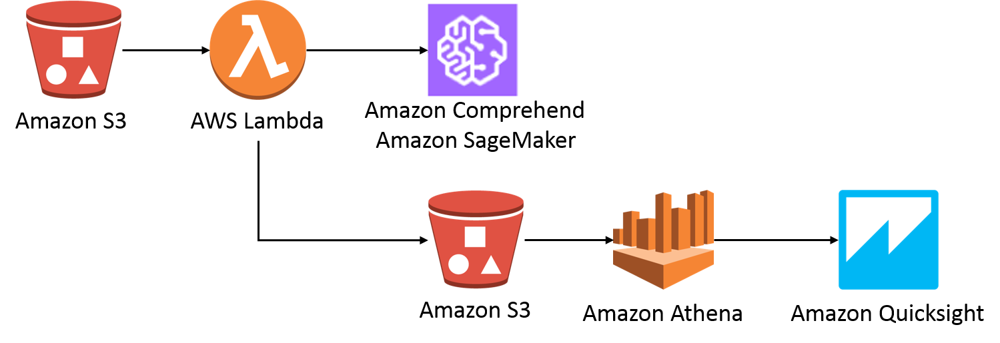

The solution will simulate streaming tweets from users of interest. These tweets are from known ISIS fanboy twitter accounts. We will collect over 17,000 tweets into an S3 bucket.

When the tweets are added to the bucket, those records are consumed by a Lambda function that analyzes their text with Comprehend to detect their sentiment and find entities. The Lambda function will also pass the tweets through the SageMaker endpoint we deployed in an earlier lab. The model outputs for each tweet are stored in separate objects in an S3 bucket. Each object contains a batch of analyzed tweets in JSON format, with one object per line to be able to use Athena, and a flat structure to make it easier to work with them.

Once the data is in S3, you will create Athena tables and QuickSight data sets in order to run analysis and visualizations over the collected tweets.

# Prerequisites

- An AWS account with enough privileges
- Use a region that supports QuickSight, e.g.: us-east-1.


# Set up your environment

## Create a SageMaker Notebook

To simulate tweets streaming to our bucket, we will execute the following script in an empty Jupyter Notebook, leveraging the SageMaker Notebook Instance we created in an earlier lab.
1. Go to [Amazon SageMaker](https://console.aws.amazon.com/sagemaker/home?region=us-east-1#/dashboard)
2. Click the "1 Notebook in Servce box"
3. Click *Open* to launch the Notebook Instance
4. In the top right corner, select *New* and then "conda_python3" to create a blank notebook. 
5. Paste in the code below into the first sell, but do not execute code yet!
````
import os
import csv


BUCKET_NAME = '<insert bucket name here>'
s3.Bucket('wwps-sagemaker-workshop').download_file('tweets.csv', 'tweets.csv')

def split_csv(source_filepath, dest_folder, split_file_prefix,
                records_per_file):
    """
    Split a source csv into multiple csvs of equal numbers of records,
    except the last file.

    Includes the initial header row in each split file.

    Split files follow a zero-index sequential naming convention like so:

        `{split_file_prefix}_0.csv`
    """
    if records_per_file <= 0:
        raise Exception('records_per_file must be > 0')

    with open(source_filepath, 'r') as source:
        reader = csv.reader(source)
        headers = next(reader)

        file_idx = 0
        records_exist = True

        while records_exist:

            i = 0
            target_filename = f'{split_file_prefix}_{file_idx}.csv'
            target_filepath = os.path.join(dest_folder, 'temp.csv')

            with open(target_filepath, 'w') as target:
                writer = csv.writer(target)

                while i < records_per_file:
                    if i == 0:
                        writer.writerow(headers)

                    try:
                        writer.writerow(next(reader))
                        i += 1
                    except:
                        records_exist = False
                        break
            obj = s3.Object(BUCKET_NAME, target_filename)
            obj.put(Body=open('temp.csv', 'rb'))

            if i == 0:
                # we only wrote the header, so delete that file
                os.remove(target_filepath)

            file_idx += 1
            
split_csv('tweets.csv', '.', 'twitter_stream', 10)
````

# Create S3 Buckets

We will create two S3 buckets, the first will be where our simulated streaming tweets will do. The second will be where the tweet data is sent to. This bucket will host all of the objects produced by the Lambda function and serve them to Amazon Athena to run queries over them.

1. In the AWS Management Console, click on **Services** and then on **S3**.
2. Click on the **Create bucket** button.
3. Give the bucket a name like lab-tweets-input-yourname (this name needs to be globally unique) in the same region as your SageMaker notebook instance.

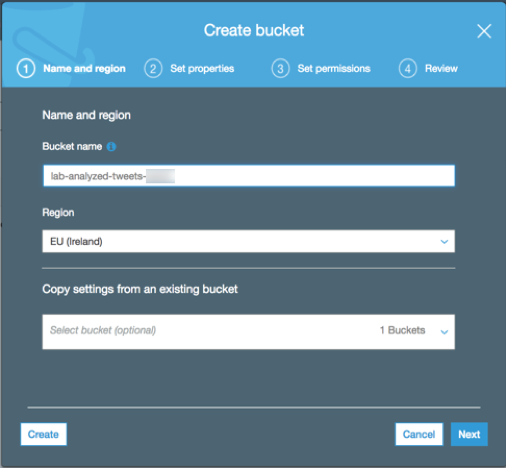

4. Click on the **Create** button, which will apply the default settings (non-encrypted, private, full permissions for owner, etc.).
5. In the Amazon S3 console, click *Create bucket* again.
6. Give this bucket a name like lab-tweets-output-yourname
7. Take note of both names, you will need them in later steps

# Create a Lambda stream consumer function

1. In the AWS Management Console, click on **Services** and then on **Lambda** under the **Compute** category.
2. Click on **Create a function** and select **Author from scratch**.
3. Give the function a name like tweets_analyzer, select the **Python 3.6** runtime, select the **Create new role from template(s)** option, and give the role a name such as lab-tweets-analyzer-lambda-role.

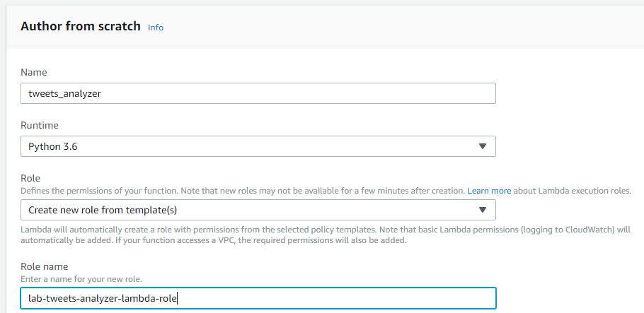

1. Click on **Create function**. This action creates the Lambda function and its associated role with some permissions., but these permissions are not enough to run the solution, as it needs to read from a Kinesis data stream, use Amazon Comprehend, and write on S3. You will deal with that after the function is created and configured.
2. Now you need to populate the function code. Scroll up to the designer and click on the Lambda function button with the name you gave it to open the function code editor. Scroll down and substitute the code in the editor with the following code, changing the bucket name to your ouput bucket name.
```
import boto3
import base64
import json
import csv

BUCKET_NAME = '<lab-tweets-output-youname>'

s3 = boto3.resource('s3')
comprehend = boto3.client('comprehend')

def lambda_handler(event, context):
    for record in event['Records']:
        bucket = record['s3']['bucket']['name']
        obj_key = record['s3']['object']['key']
        data = s3.Object(bucket, obj_key).get()
        
        data = data['Body'].read().decode('utf-8')
        data = [row for row in csv.reader(data.splitlines(), delimiter=',')]
        data = data[1:]
    
        #Build a string that contains the original tweet id, text and its sentiment and entities
        tweets = []
        strings = []
    
        for record in data:
            tweet = record
            strings.append(tweet[7])
            tweets.append({
                'id': tweet[0],
                'text': tweet[7],
                'created_at': tweet[6]})
    
        i = 0
        sentiment_data = ''
        entities_data = ''
        keyphrases_data = ''
        
        # Detect sentiment and entities found in the text of the tweets
        sentiments = comprehend.batch_detect_sentiment(TextList=strings, LanguageCode='en')
        entities = comprehend.batch_detect_entities(TextList=strings, LanguageCode='en')
        keyphrases = comprehend.batch_detect_key_phrases(TextList=strings, LanguageCode='en')
        
        for tweet in tweets:
         # Flatten the objects to make them easily queriable
                sentiment_data += json.dumps({
                    'tweet_id': tweet['id'],
                    'tweet_text': tweet['text'],
                    'tweet_date': tweet['created_at'],
                    'sentiment': sentiments['ResultList'][i]['Sentiment'],
                    'positive_score': sentiments['ResultList'][i]['SentimentScore']['Positive'],
                    'negative_score': sentiments['ResultList'][i]['SentimentScore']['Negative'],
                    'mixed_score': sentiments['ResultList'][i]['SentimentScore']['Mixed'],
                    'neutral_score': sentiments['ResultList'][i]['SentimentScore']['Neutral']
                }) + '\n'
        
                for entity in entities['ResultList'][i]['Entities']:
                    entities_data += json.dumps({
                        'tweet_id': tweet['id'],
                        'tweet_text': tweet['text'],
                        'tweet_date': tweet['created_at'],
                        'entity': entity['Text'],
                        'score': entity['Score'],
                        'type': entity['Type']
                    }) + '\n'
                    
                for phrase in keyphrases['ResultList'][i]['KeyPhrases']:
                    keyphrases_data += json.dumps({
                        'tweet_id': tweet['id'],
                        'tweet_text': tweet['text'],
                        'tweet_date': tweet['created_at'],
                        'entity': phrase['Text'],
                        'score': phrase['Score'],
                    }) + '\n'
        
                i += 1
        
        print('completed!')
        
        #Save the objects in S3
        sentiment_object = s3.Object(BUCKET_NAME, get_unique_file_name('sentiment'))
        sentiment_object.put(Body=sentiment_data)
        entities_object = s3.Object(BUCKET_NAME, get_unique_file_name('entities'))
        entities_object.put(Body=entities_data)
        keyphrase_object = s3.Object(BUCKET_NAME, get_unique_file_name('keyphrase'))
        keyphrase_object.put(Body=keyphrases_data)
    
    return

def get_unique_file_name(folder=''):

    import datetime
    from random import randint

    #Adding a random prefix to improve partitioning and uniqueness
    unique_filename = folder + '/{:03}-'.format(randint(0,999)) + datetime.datetime.now().isoformat() + ".json"
    
    return unique_filename

#This function extracts the date time in a proper format for the

def get_datetime_from_tweet(tweet):
    import time
    ts = time.strftime('%Y-%m-%d %H:%M:%S', time.strptime(tweet['created_at'],'%a %b %d %H:%M:%S +0000 %Y'))

    return ts
```
3. Scroll down and, in the **Basic settings** section, set the timeout to 1 minute.
4.  Click the **Save** button on the top right corner.

# Edit the Lambda function IAM Role

In this section, you are going to add managed policies to the role that the Lambda function assumes to access AWS resources.

1. In the AWS Management Console, click on **Services** and then on **IAM**.
2. Click on **Roles** , search the role that you created in the previous section (suggested name was lab-tweets-analyzer-lambda-role), and click on its name.
3. Click on the **Attach policy** button.
4. Search for and select AmazonSageMakerReadOnly, ComprehendReadOnly, and AmazonS3FullAccess. Please, note that these are AWS managed policies, hence not controlling access to specific resources within a service. You can grant access to certain API actions or to specific resources within the services (such as specific S3 buckets or Kinesis streams) by using custom policies or resourced-based policies if supported (e.g.: S3 bucket policies).
5. Click on **Attach policy**. This will show the policies attached.

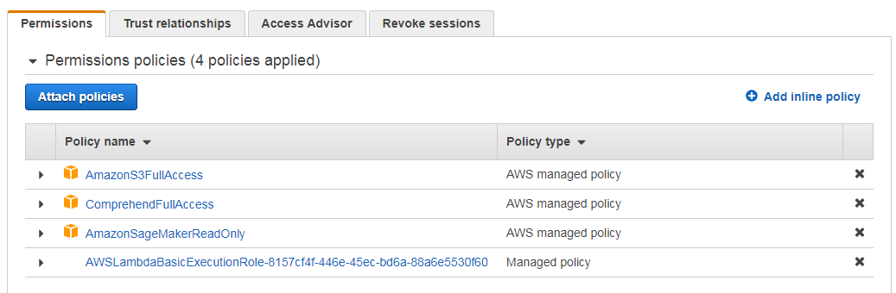

# Add a trigger to the Lambda function

The Lambda function requires a trigger to be executed, in this lab it is a S3 Event trigger.

1. Go back to the AWS Lambda console and click on the function you created earlier. In the **Designer** block of the current screen, click on the S3 button on the left side. S3 will appear as a trigger for the function as in the following figure.

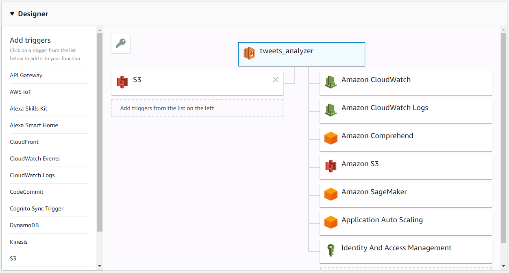

2. Scroll down and configure the **Bucket** to match you input bucket name (ex. lab-tweets-input-yourname). 
3. Select the Event Type to be PUT. Click on the **Add** button.

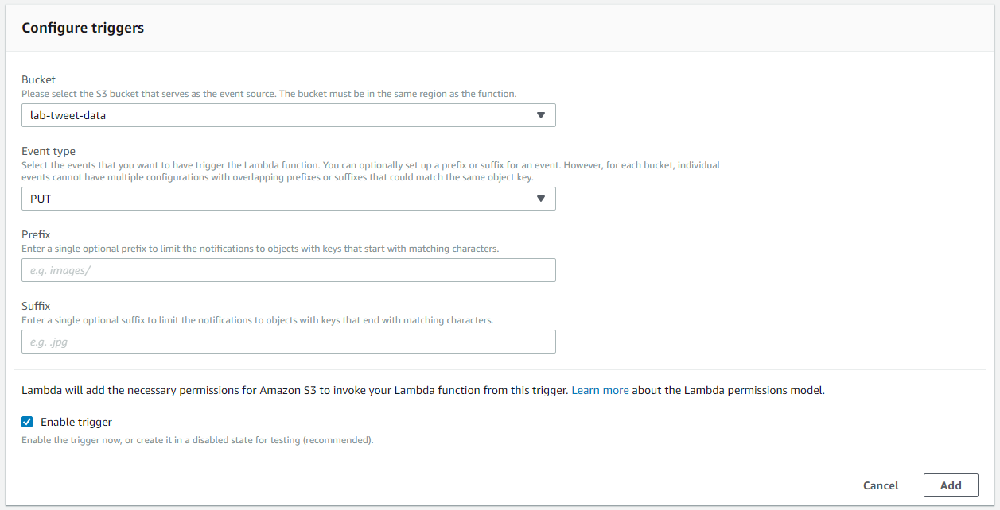

3. Click on the configured trigger and switch it to **Enabled** , then click **Save**.

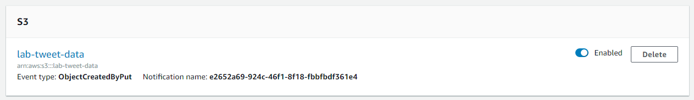

4. Now that the trigger is enabled, your Lambda function will start processing S3 Event records; you can monitor the function invocations in CloudWatch or in the **Monitoring** tab within the function. You can also check your S3 bucket and see that there are new objects.

# Begin Streaming tweets

To begin triggering the Lambda function we will execute the code we put into the SageMaker Notebook earlier to begin generating batches of tweets.

1. Go back to [Amazon SageMaker](https://console.aws.amazon.com/sagemaker/home?region=us-east-1#/dashboard) and your SageMaker Notebook Instance
2. In the notebook you created earlier in this lab replace the BUCKET_NAME with your input bucket name (ex. lab-tweets-output-youname)
3. Hit Ctrl+Shift to begin executing the code
4. You can monitor your Lambda function being triggered in the Lambda Console, return to you lambda function and click the Monitoring tab

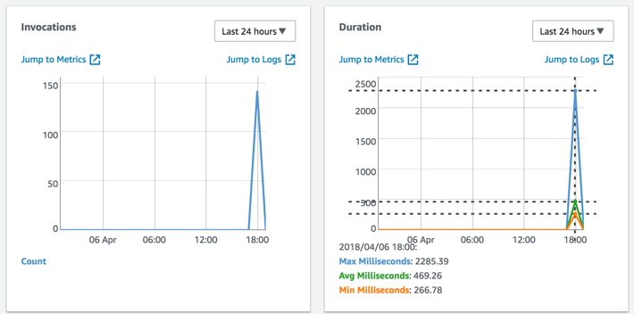

# Create tables in AWS Glue data catalog

In order to leverage the data stored in S3, QuickSight is going to use Athena to run queries. For that is necessary to create two tables, one for the tweets' sentiment and another for their found entities. You can create these tables manually, but AWS Glue can do that for you.

1. In the AWS Management Console, click on **Services** , then on **AWS Glue**.
2. Click on **Databases** on the left side and **Add database**. Name the database as lab_analyzed_tweets and click **Create**.
3. In order to create the tables, AWS Glue uses a Crawler. Click on **Crawlers** , then on **Add crawler**.
4. Name the crawler tweets_crawler and click **Next**.
5. Select **S3** as the data store and introduce s3://yourbucketname in the **Include path** field. Click **Next** twice.
6. Select **Create an IAM role** and add a suffix to the name such as lab-tweets-analysis. Click **Next** twice.
7. Select the lab_analyzed_tweets table click **Next**.
8. Click **Finish**.
9. Select the newly created crawler and click **Run crawler**. It will take around 2-3 to finish.
10. Once it has finished, click on Tables on the left and then inspect each of the three tables. You can see some properties of the tables and their schema.

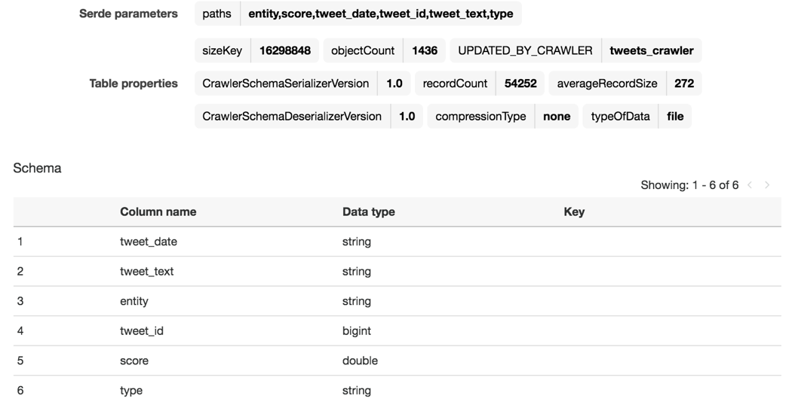

1. The crawler didn't identify the column tweet_date_ as a timestamp, so you need to change it. For this, click on **Edit schema** on the top right corner, then click on the tweet_date column, select the **TIMESTAMP** type, and click **Update**. Finally, click **Save**.
2. Do the same with the other table.
3. Go to the Athena console: click on **Services** , then on **Athena**. There, you can select the newly created database and run queries against them, for example:
```
SELECT sentiment, count(*) AS NumberOfTweets FROM sentiment GROUP BY sentiment
```
Now, you are ready to use QuickSight to run analysis and visuals over the analyzed tweets!

# Create a Standard QuickSight account

You can skip this section if you already have a QuickSight account.

1. Click on **Services** and then on **QuickSight**.
2. Introduce a valid e-mail address.
3. Click on Sign up for QuickSight, select the Standard edition and then **Continue**.
4. Select the region you have been using in this lab.
5. Click **Finish**.
6. Click **Go to Amazon QuickSight**.

# Give QuickSight permissions to access S3

QuickSight needs permissions to access the data in your S3 buckets.

1. On the AWS Management Console, click on **Services** , then on **IAM**.
2. Click on **Roles** on the left side.
3. Find a role whose name starts with **aws-quicksight-service-role** and click on it.
4. Click on **Add inline policy**.
5. Click on **Service** and select **S3**.
6. Click on **Actions** and select **List** and **Read**.
7. Click on **Resources** and click on **Add ARN** at the **bucket** row.
8. Write the name of your bucket where the analyzed tweets are and click on **Add**.
9. Repeat for the **objects** row and click on **Any** for objects, then click on **Add**.

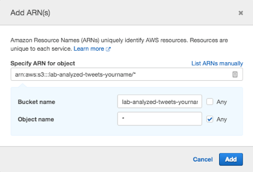

10. Click on Review policy, give it a name such as lab-quicksight-s3-policy_, and then click on **Create policy**. It should look similar to the following figure.

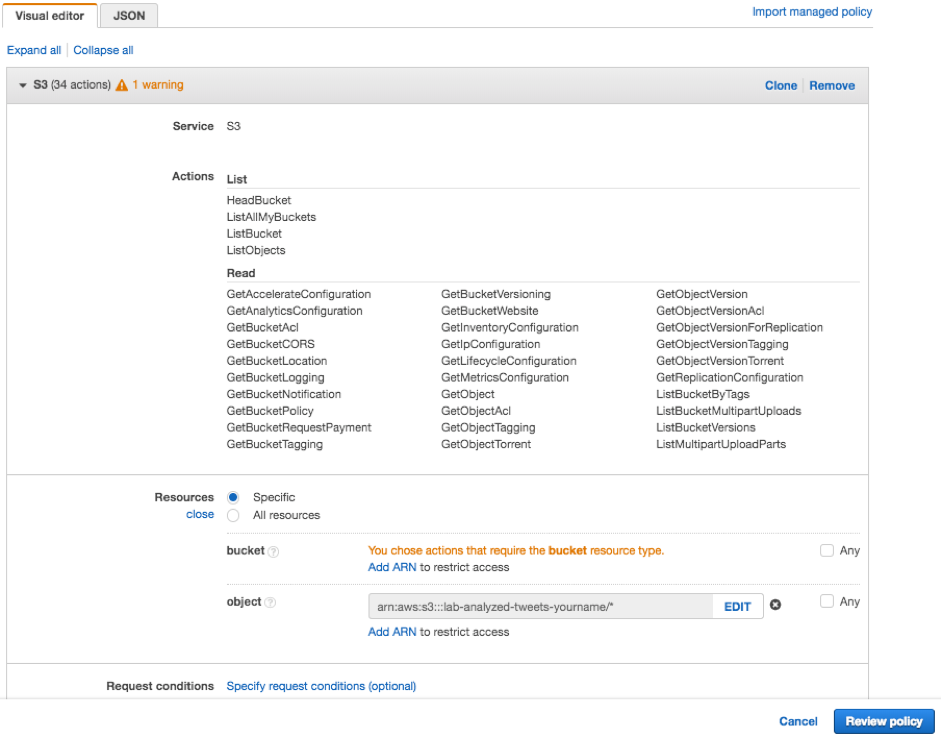

# Create a QuickSight data set

QuickSight works with data sets that you define and can come from several different sources, such as Salesforce, Amazon RDS, Amazon Redshift and more. Once you have created a QuickSight account and are in the QuickSight console, follow these steps:

1. Click on **Manage Data** on the top-right corner, then on **New data set**.
2. Click on Athena and give the data source a name such as tweets-entities, then click on **Create data source**.
3. Select the lab_analyzed_tweets_ database(or the database you created previously).
4. Select any of the tables and click on **Edit/Preview data**.
5. On the left side, expand the **Tables** tab and select both tables in the database.
6. On the diagram on the right, click on the two pink circles between the tables to configure the join relationship.
7. Under the diagram, click on each table name and select tweet_id_ as the joined field, then click Apply.

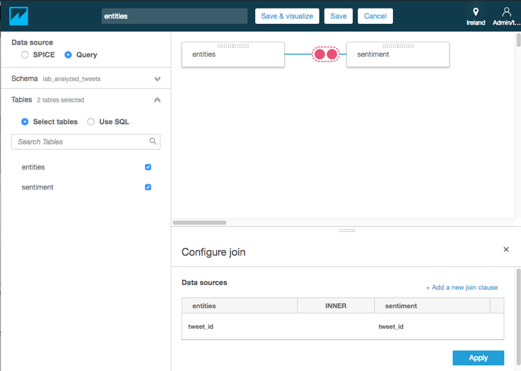

8. Since the two joined tables have some common fields, you can remove the ones coming from one of the tables. Expand the **Fields** tab on the left, that will show all the fields from the joined tables.
9. Deselect _tweet_date_, _tweet_text_ and _tweet_id_ from one of the tables.
10. To make the field names look nicer, it is worth to rename the table name suffix from the fields that are selected. For that, click on the down arrow at the right side of the field name and then on **Rename field** and remove the [tablename] part of the name, then click **Apply**. Do this for tweet_date_, tweet_text_ and tweet_id_.
11. Click on **Save & visualize**.
12. Start exploring visualizations by clicking on the fields on the left side!

You can also create single-table data sets by, in step 4, clicking on the **Select** button.

In order to create a second data set, click on the QuickSight icon on the top-left corner and follow the previous steps, but now select the _sentiment_ table.

# Optional challenge

Now that you have sentiment analysis and entities detection, add key phrase detection to the solution.

# Clean-up

All of the following steps are optional, but you may incur in costs if you don't clean-up.

## Delete QuickSight account

Follow the steps specified [here](https://docs.aws.amazon.com/quicksight/latest/user/closing-account.html).

## Delete assets from AWS Glue data catalog

1. Enter the AWS Cloud9 terminal session.
2. Run the following command (substitute the name for your own if different) to delete the database.

```aws glue delete-database --name lab_analyzed_tweets```

3. Run the following command (substitute the name for your own if different) to delete the crawler.

```aws glue delete-crawler --name tweets_crawler```

## Delete the Lambda function, its role, and related assets

1. Enter the AWS Cloud9 terminal session.
2. Run the following command (substitute the name for your own if different) to delete the Lambda function

```aws lambda delete-function --function-name tweets_analyzer```

3. Run the following command (substitute the name for your own if different) to delete the role that the Lambda function assumed

```aws iam delete-role --role-name lab-tweets-analyzer-lambda-role```

## Delete CloudWatch Logs

1. Enter the AWS Cloud9 terminal session.
2. Run the following command (substitute the name for your own if different) to delete the Lambda function CloudWatch Logs

```aws logs delete-log-group --log-group-name /aws/lambda/tweets_analyzer```

3. Run the following command (substitute the name for your own if different) to delete the AWS Glue CloudWatch Logs

```aws logs delete-log-group --log-group-name /aws-glue/crawlers```

## Delete the S3 Bucket

1. Enter the AWS Cloud9 terminal session.
2. Before deleting the bucket, first it needs to be emptied. Run the following command (substitute the name for your own).

```aws s3 rm s3://lab-analyzed-tweets-yourname/ --recursive```

3. Run the following command (substitute the name for your own) to delete the bucket.

```aws s3 rb s3://lab-analyzed-tweets-yourname/```

There may be other buckets created by Athena to store results, proceed as previously to delete them substituting the names.
